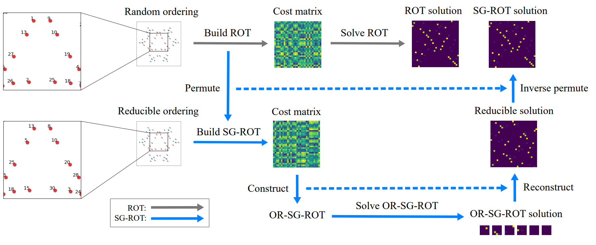

# SG-ROT

This repository contains the code for synthetic experiments in the ICML 2026 paper  

**"Optimal Transport with Symmetry Groups"**  
*Jiechao Zhang, Huichun Zhang, Jian Sun, Wei Zeng*


## Method Overview

The figure below illustrates the workflow of SG‑ROT:  
- Orbit identification and permutation;  
- Solving the reduced OR-SG-ROT problem;  
- Reconstruction and inverse permutation.



*Figure 3 from the paper: Workflow of SG‑ROT.*


## Requirements

- Python 3.10
- CUDA 12.4
- Install dependencies:
  ```bash
  pip install torch==2.5.1+cu124 --index-url https://download.pytorch.org/whl/cu124
  pip install numpy==2.2.6 scipy==1.15.3 pandas==2.3.3 matplotlib==3.10.8 pyyaml==6.0.3 pot==0.9.6.post1
  ```

## Quick Start

- **Generate configuration files**

  This script will automatically create a `config/` folder containing YAML configuration files for the default dihedral group settings, and you can modify the script to generate other experimental configurations.

  ```bash
  python create_config_files.py
  ```

- **Run all experiments**

  This script reads the YAML files from `config/` and executes the corresponding experiments.

  ```bash
   python run.py
  ```

## Output Structure

After running the commands, the following directories and files are created automatically:

- **`config/`** – Contains YAML configuration files for each experiment.  
  Directory structure:  
  `config/{group_type}/{ordering_type}/orbit_num{orbit_num}_group_order{group_order}/{method}_config.yaml`

- **`data/`** – Stores synthetic data.  
  Directory structure:  
  `data/{group_type}/{ordering_type}/orbit_num{orbit_num}_group_order{group_order}/`  
  Inside each folder, you will find:
  - `{ordering_type}_source_points.csv` – source point coordinates.
  - `{ordering_type}_source_points.png` – scatter plot of source points.
  - `{ordering_type}_source_w.csv` – source probability measure.
  - `{ordering_type}_target_points.csv` – target point coordinates.
  - `{ordering_type}_target_points.png` – scatter plot of target points.
  - `{ordering_type}_target_w.csv` – target probability measure.
  - `{ordering_type}_C.csv` – pairwise distance matrix between source and target points.
  - `{ordering_type}_C.png` – heatmap visualization of the cost matrix.

- **`result/`** – Contains all experimental results.  
  Directory structure:  
  `result/{group_type}/{ordering_type}/orbit_num{orbit_num}_group_order{group_order}/`  
  Inside each folder, you will find:

  **For LOT and EROT methods:**
  - `{method}_info.csv` – detailed results.
  - `{method}_P.csv` – optimal transport plan matrix.
  - `{method}_P.png` – image of the transport plan.
  
  **For other methods:**
  - `{method}_info.csv` – detailed results.
  - `{method}_P.png` – image of the transport plan.

-  **`result/all_records.csv`** – A master summary file aggregates mean/std statistics of time, cost, and matrix distance across all configurations.


## Supported Parameters

The placeholders `{group_type}`, `{ordering_type}`, `{orbit_num}`, `{group_order}`, and `{method}` accept the following values:

- **`{group_type}`** – Finite symmetry group. Options: `'Z'`, `'D'`, `'T'`, `'O'`, `'I'`. Default: `'D'`.

- **`{ordering_type}`** – Arrangement of points. Options: `'block'`, `'random'`.

- **`{orbit_num}`** – Number of group orbits. Defaults: `'Z': [1600]`, `'D': [800, 5]`, `'T': [400]`, `'O': [200]`, `'I': [80]`. Modifiable in script.

- **`{group_order}`** – Group order. Constraints: `'Z'`: any integer; `'D'`: any even integer; `'T'`: 12; `'O'`: 24; `'I'`: 60.

- **`{method}`** – Optimal transport solver. For `'block'`: `C_LOT, SG_LOT, LOT, C_EROT, SG_EROT, EROT`. For `'random'`: `SG_LOT, LOT, SG_EROT, EROT`.

To generate other configurations, uncomment entries in `create_config_files.py` and adjust parameter lists.


## Citation

```bibtex
@inproceedings{zhang2026sgrot,
  title={Optimal Transport with Symmetry Groups},
  author={Zhang, Jiechao and Zhang, Huichun and Sun, Jian and Zeng, Wei},
  booktitle={International Conference on Machine Learning (ICML)},
  year={2026}
}
```

## Contact

For any problem, please do not hesitate to contact jichzh@stu.xjtu.edu.cn.
